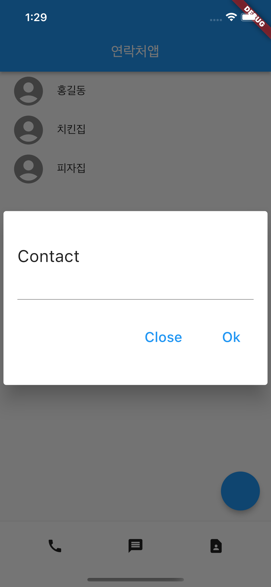
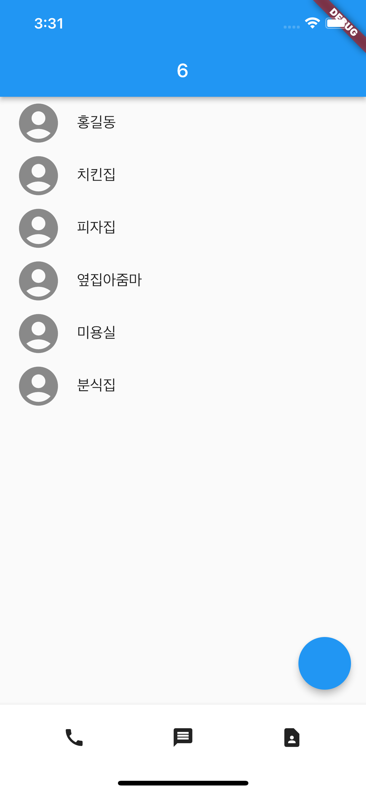
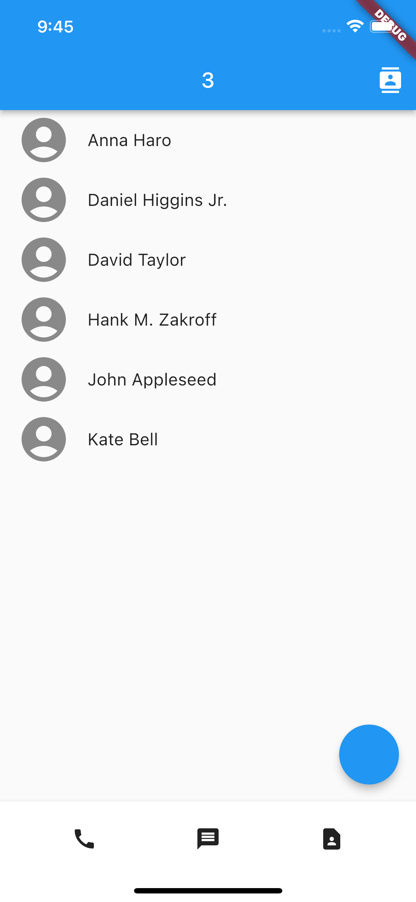

## Check Widget parameters (Android Studio)
* Mac: ⌥ + spacce

## Widgets
### Row() or Column()
mainAxisAlignment 파라미터로 위젯들이 배치되는 간격을 조절할 수 있습니다. 

### SizedBox()
Container()인데 사이즈만 필요할 때 씁니다.

<details>
<summary>C1_exercise1</summary>
</details>

<details>
<summary>C1_exercise2</summary>
</details>

<details>
<summary>C1_exercise3</summary>
</details>

<details>
<summary>C1_exercise4</summary>

</details>


<br>

## Dialog/모달창
```dart
showDialog(context: context, builder: (context) {
    return Dialog(child: Text('안녕'));
});
```

## Context
부모위젯의 정보를 담고 있는 변수
```dart
// context 확인
// MaterialApp이 context에 있는지
print(context.findAncestorWidgetOfExactType<MaterialApp>());
```

<details>
<summary>C1_exercise5</summary>

</details>

<br>

## 부모 -> 자식 state 전송하는 법 
1. 보내기 
```dart
dartDialogexample(state : a),  // 작명: 변수명
```

2. 자식은 state 이름을 등록
```dart
class Dialogexample extends StatelessWidget {
  const Dialogexample({Key? key, this.state }) : super(key: key);
  final state;
}
```

3. 자식은 사용  
```dart
Text(state.toString())
```

<br>

## 부모 위젯이 자식 위젯 state를 변경하고 싶으면
1. 부모 위젯안에 state 조작하는 함수를 미리 만들기  
```dart
addOne(){  // 함수 만들기
    setState(() {
      total++;
    });
  }
```

2. 부모 -> 자식 이렇게 state 조작하는 함수를 전송
```dart
floatingActionButton: Dialogexample( addOne : addOne )  // 작명: 변수명
```

3. 자식은 그걸 등록
```dart
class Dialogexample extends StatelessWidget {
  const Dialogexample({Key? key, this.addOne }) : super(key: key);
  final addOne;
}
```

4. 자식은 사용
```dart
onPressed: () {
// Navigator.pop(context);
    addOne();
},
```

<br>

##  사용자가 입력한 input 받기

> var inputData = TextEditingController();  // 유저가 입력한 데이터를 변수에 담기  
TextField( controller: inputData,),

> var inputData2 = '';  
TextField( onChanged: (text){ print(text); },),  // 파라미터에 데이터 담기

<details>
<summary>C1_exercise6</summary>

</details>

<br>

## 유저에게 앱 권한 요청하기

### 패키지 설치
 "유저에게 앱권한 쉽게 요청할 수 있는 외부 패키지"를 사용합니다. 
```dart
// pubspec.yaml
dependencies:
  flutter:
    sdk: flutter
  permission_handler: ^8.3.0
```
pubspec.yaml에 permission_handler를 설정한 후에 노란 전구가 뜨면 pub get을 눌러서 패키지를 설치합니다.

```dart
import 'package:permission_handler/permission_handler.dart';
```
main.dart에 permission_handler.dart 파일에 있는 함수와 변수들을 가져다쓸 수 있게 해주는 문법을 사용하면 패키지 설치 끝입니다.

### 아이폰 셋팅 (m1 맥북)
#### 1. 프로젝트 켜놓은 상태에서 터미널을 오픈합니다. (Android Studio는 상단 View - Tool Windows - Terminal)
```dart
cd ios
sudo arch -x86_64 gem install ffi
sudo arch -x86_64 gem install cocoapods
```
그대로 입력합니다.

#### 2. ios 디렉토리 안에 Podfile이 있는데 (없으면 터미널에 pod init 입력) 파일 안에 `post_install do |installer|` 으로 시작되는 부분을 지우고 아래의 내용을 입력해줍니다.
```dart
post_install do |installer|
  installer.pods_project.targets.each do |target|
    flutter_additional_ios_build_settings(target)
    target.build_configurations.each do |config|
      config.build_settings['GCC_PREPROCESSOR_DEFINITIONS'] ||= [
        '$(inherited)',
        'PERMISSION_CONTACTS=1',
         # 추가할거 더 있으면 이 자리에 넣어주세요
      ]
    end
  end
end 
```

https://pub.dev/packages/permission_handler 에 권한에 대한 예시를 확인할 수 있습니다.  
카메라 권한 설정 -> 'PERMISSION_CAMERA=1',  
마이크 권한 설정 -> 'PERMISSION_MICROPHONE=1'

#### 3. ios/Runner/Info.plist을 열어서
```dart
<key>NSContactsUsageDescription</key>
<string>님 폰의 연락처 권한이 필요합니다 제발 주셈</string> 
```
을 추가합니다. 권한 요청시 팝업띄울 때 안내문 넣는 부분입니다. 다른 권한이 있으면 동일하게 `Info.plist`에 추가해야합니다.  

### 유저에게 사용권한 달라고 요청하는 방법
`print(Permission.contacts.status);`사용하면  
연락처 권한 상태를 출력할 수 있습니다. 유저에게 연락처 사용권한을 달라고  
요청을 하려면 `Permission.contacts.request()`를 실행해주면 됩니다.

보통 `Permission.contacts.status`를 변수에 저장해놓고    
조건문을 사용해서 `isGranted(허락)`이면 이 코드를 실행하고  
`isDenied(거절)`이면 이 코드를 실행하라면 코드를 짜면 된다.

```dart
// 유저가 사용권한 허락, 거절시 조건문
getPermission() async {
    var status = await Permission.contacts.status;
    if (status.isGranted) {
      print('허락됨');
    } else if (status.isDenied) {
      print('거절됨');
      Permission.contacts.request();
    }
} 

// 아이폰 - OS가 금지하는 경우 (status.isRestricted)
// 안드로이드 - 아예 앱 설정에서 꺼놓은 경우 (status.isPermanentlyDenied)
// 체크시
if (status.isPermanentlyDenied) {
  openAppSettings();  // 앱 설정 기능 오픈
} 
```

## 유저 연락처 가져오는 패키지
### 1. pubspec.yaml 파일에서 패키지 설치
```dart
dependencies:
  flutter:
    sdk: flutter
  permission_handler: ^8.3.0
  contacts_service: ^0.6.3
```

pubspec.yaml에 contacts_service를 설정한 후에  
노란 전구가 뜨면 pub get을 눌러서 패키지를 설치합니다.

### 2. main.dart 파일에서 패키지 import
```dart
// Import package  
import 'package:contacts_service/contacts_service.dart';  
```

main.dart 파일에 추가하면 끝입니다.  
https://pub.dev/packages/contacts_service 에 패키지 사용방법에 대해  
더 자세히 알 수 있습니다.

### 3. 유저 연락처 다루는 패키지 사용
* 비동기 처리를 할 수 있는 async function 선언을 한 함수 내 사용합니다.
* await ContactsService.getContacts() 함수를 contacts 변수에 저장해서 연락처 정보를 가지고 옵니다.
```dart
  getPermission() async {
    var status = await Permission.contacts.status;
    if (status.isGranted) {
      print('허락됨');
      // 변수 가져오기
      // Get all contacts without thumbnail (faster)
      var contacts = await ContactsService.getContacts(withThumbnails: false);
      print(contacts[0].displayName);
    } else if (status.isDenied) {
      print('거절됨');
      Permission.contacts.request();
    }
  }
```

### 4. 사용자 연락처를 list로 보여주기
* 가져온 연락처들을 ListView.builder()에 보여줘야 합니다.
* name이라는 state안의 자료 갯수만큼 ListView를 생성하고 있기 때문에 name이라는 변수에 contacts를 넣어야 합니다.

Icons.contacts 아이콘을 클릭하면 List로 연락처를 보여줍니다.

먼저, name 변수는 List<String> 만 넣을 수 있는데
`contacts[index].displayName` 은 List<Contact> 이기 때문에
변수의 타입을 바꿔줍니다.
```dart
var name = ['영희', '횟집', '미용실']; 이거를
var name = []; 이걸로 고쳤습니다
```
고치면 name 변수는 타입이 `List<dynamic>` 이 됩니다. dynamic은 그냥 모든 타입을 뜻합니다. 그래서 아무거나 담긴 리스트를 넣을 수 있는 변수가 완성된 것입니다. (빈 리스트만 집어넣어주면 자동으로 `List<dynamic>` 타입이 됩니다)

```dart
  getPermission() async {
    var status = await Permission.contacts.status;
    if (status.isGranted) {
      print('허락됨');

      // 변수 가져오기
      var contacts = await ContactsService.getContacts(withThumbnails: false);
      print(contacts[0].displayName);

      setState(() {
        name = contacts;
      });
    } else if (status.isDenied) {
      print('거절됨');
      Permission.contacts.request();
    }
  }
```

<details>
<summary>C1_exercise7</summary>

</details>

### 5. Dialog에 이름 입력하고 완료 누르면 입력한 이름으로 연락처가 추가되는 기능을 만들기
* ListView 안의 목록에도 새로운 이름이 보여야합니다. 
  - 1. 연락처 저장
  - 2. 목록에 보여주고 싶으면 state 수정

```dart
Future addName(text) async{
  var status = await Permission.contacts.status;  // permission 상태
  if (status.isGranted) {  // 유저가 사용 권환을 허락했다면
    var newContact = Contact();  
    newContact.givenName = text;  // 새로운 연락처 만들기
    await ContactsService.addContact(newContact);  // 실제로 연락처에 집어넣기
    var contacts = await ContactsService.getContacts();  // 연락처 다시 불러오기
    setState(() {
      name = contacts;  // name state에 저장
    });
  } else if (status.isDenied) {  // 유저가 사용 권환을 거절했다면
    setState(() {
      name.add(text);
      print(name);
    });
  }
}
```