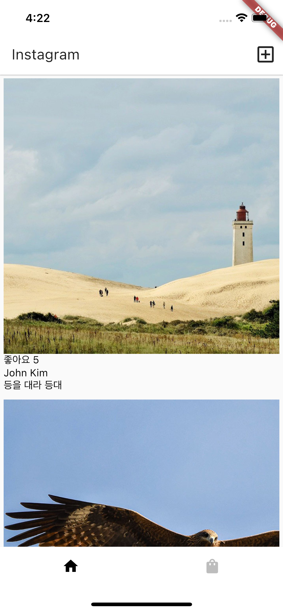

# Flutter로 만드는 Instagram App
## analysis_options.yaml 파일 수정
--
rules 수정
```yaml
rules:
  prefer_typing_uninitialized_variables: false
  prefer_const_constructors_in_immutables: false
  prefer_const_constructors: false
  avoid_print: false
  prefer_const_literals_to_create_immutables: false 
```

## MaterialApp()에서 ThemeData()으로 스타일 관리
* iconTheam
* appBarTheme
  * actionsIconTheme
* textTheme
  * bodyMedium <- Text() (flutter 3.7.12)
  * ListTile <- subtitle1 (현재 바뀜)
  * TextButton <- button
  * AppBar <- headline6 (현재 바뀜)
```dart
void main() {
  runApp(MaterialApp(
    theme: ThemeData(
      appBarTheme: AppBarTheme(backgroundColor: Colors.yellow
      )
    ),
    home: MyApp(),
  ));
}
```
<details>
<summary>C2_exercise1</summary>

</details>

<br>

* textButtomTheme
  * style
    * backgroundColor
```dart
ThemeData(
  textButtonTheme: TextButtonThemeData(
    style: TextButton.styleFrom(
      primary: Colors.black,
      backgroundColor: Colors.orange,
    )
  ),
)
```

### ThemeData() 안의 특정스타일 불러오기
```dart
// style.dart
textTheme: TextTheme(
        bodyMedium: TextStyle(color: Colors.amber),
        bodySmall: TextStyle(color: Colors.black)
  )

// main.dart
// Textcolor is amber
body: Text('안녕', style: Theme.of(context).textTheme.bodyMedium,),
// Textcolor is black
body: Text('안녕', style:Theme.of(context).textTheme.bodyLarge,),
```


<br>

## import 할 때 변수 중복문제 피하기
### 1. alias 붙이기
```dart
import './style.dart' as style;
```
이라고 alias를 붙이고 `./style.dart'`에서의 변수를 쓸 때
`style.theme`을 불러오면 됩니다.

### 2. _ 언더바 붙이기
```dart
// style.dart
var _var1 = ; 
```
변수를 다른 파일에서 쓰기 싫으면 `_변수명_함수명_클래스명`을 붙이면 됩니다.

<br>

## 동적인 UI 만드는 법
### 1. 현재 UI의 현재 상태를 저장할 state를 만듭니다.
### 2. 그 state에 따라서 현재 UI가 어떻게 보일지 코드짜놓습니다.
### 3. 유저가 쉽게 state 조작할 수 있게 기능도 개발합니다.

## PageView()
https://youtu.be/J1gE9xvph-A

<details>
<summary>C2_exercise2</summary>

</details>

<br>

## 서버와 데이터 주고받기
서버는 데이터를 달라고 요청하면 데이터를 주는 간단한 프로그램입니다.
### 1. method는 GET/POST 택 1  
* GET: 데이터 읽고 싶을 때
* POST: 데이터 보내고 싶을 때
### 2. url 기입

<br>

### Get 요청날리는 법
http라는 이름의 패키지 설치가 필요합니다. `pubspec.yaml` 파일 열어서
```yaml
// pubspec.yaml
dependencies:
  http: ^0.13.4
```
추가하고 `pub get`을 눌러서 설치합니다.

`main.dart`파일에 들어가서 맨 위에
```dart
// main.dart
import 'package:http/http.dart' as http;
import 'dart:convert';
```
패키지를 import합니다. dart:convert는 JSON -> 일반자료형 변환을 도와주는 패키지입니다.  

android는 android/app/src/main/AndroidManifest.xml 파일 들어가서
```xml
<uses-permission android:name="android.permission.INTERNET" /> 
```
<application> 이전에 다음과 같이 코드를 추가합니다. 이 코드는 인터넷 사용을 허락받는 코드입니다.

> 그렇다면 GET요청은 언제 요청해야할까요?   
보통 내 앱이 로드되면 바로 GET 요청을 합니다.

```dart
// main.dart
// MyApp 위젯이 로드될 때 실행

// data라는 state 함수
var data = [];

  getData() async {
    var result = await http.get(Uri.parse('url'));
    if (result.statusCode == 200) {
    var json = jsonDecode(result.body);
    setState(() {
      data = json;  // data라는 state를 만들고 거기에 저장하는 코드
      print(data);
    });
    } else {
      throw Exception('error');
    }
  }
```

> JSON -> [], {}   
JSON은 문자를 읽기 번거롭기 때문에 보통 List나 Map으로 변환해서 씁니다. 아래 코드에서 `result2[0]['user']` 처럼 이제 문자를 쉽게 가지고 올 수 있습니다. 
```dart
getData() async {
    var result = await http.get(Uri.parse('url'));
    var result2 = jsonDecode(result.body);
    print(result2[0]['user']);
  }
```

## 에러체크 하는 방법
서버가 이상하거나 GET요청 실패시 유저에게 요청실패를 안내해줄 수 있습니다.
* 서버가 다운되었거나
* 요청경로가 이상하거나
```dart
getData() async {
  var result = await http.get(
      Uri.parse('url')
  );
  if (result.statusCode == 200) {
    print( jsonDecode(result.body) );
  } else {
    // throw는 콘솔창에 빨간색으로 에러내주는 코드
    // try, catch 문법으로 모든 에러를 체크할 수 있음
    throw Exception('요청실패'); 
  }
} 
```
이러한 것을 팝업 메시지를 통해서 안내할 수 있습니다.
* Toast - https://pub.dev/packages/fluttertoast
* SnackBar - https://docs.flutter.dev/cookbook/design/snackbars

<br>

#### 숫자가 포함된 문자열 식의 값 출력
```dart
Text("좋아요 ${data[index]['likes']}"),
Text(data[index]['user']),
Text(data[index]['content'])
```
* https://dart.dev/guides/language/numbers

### 서버에서 데이터 도착 전에 쓰면 에러나는 것 방지 (null check)
if문을 써서 `data.isNotEmpty`면 ListView를 실행하게 만들면 됩니다.
```dart
class Home extends StatelessWidget{
  const Home ({Key? key, this.data}) 
  final data;
  Widget build(BuildContext context){

    if (data.isNotEmpty){
      return ListView.builder(생략);
    } else {
      return CircularProgressIndicator();
    }
  }
}
```

<details>
<summary>C2_exercise3</summary>

</details>

<br>

### Dio 패키지 설치
서버와 GET요청, POST요청할 일이 많아지면 http 패키지 대신 Dio 패키지 설치해서 사용할 수 있습니다. 

## 스크롤 위치 측정과 더보기 요청