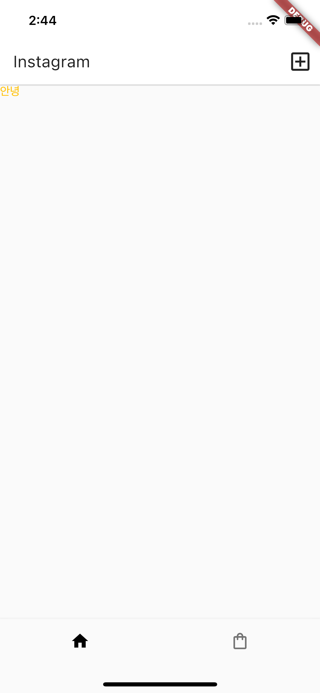

# Flutter로 만드는 Instagram App
## analysis_options.yaml 파일 수정
--
rules 수정
```yaml
rules:
  prefer_typing_uninitialized_variables: false
  prefer_const_constructors_in_immutables: false
  prefer_const_constructors: false
  avoid_print: false
  prefer_const_literals_to_create_immutables: false 
```

## MaterialApp()에서 ThemeData()으로 스타일 관리
* iconTheam
* appBarTheme
  * actionsIconTheme
* textTheme
  * bodyMedium <- Text() (flutter 3.7.12)
  * ListTile <- subtitle1 (현재 바뀜)
  * TextButton <- button
  * AppBar <- headline6 (현재 바뀜)
```dart
void main() {
  runApp(MaterialApp(
    theme: ThemeData(
      appBarTheme: AppBarTheme(backgroundColor: Colors.yellow
      )
    ),
    home: MyApp(),
  ));
}
```
<details>
<summary>C2_exercise1</summary>

</details>

<br>

* textButtomTheme
  * style
    * backgroundColor
```dart
ThemeData(
  textButtonTheme: TextButtonThemeData(
    style: TextButton.styleFrom(
      primary: Colors.black,
      backgroundColor: Colors.orange,
    )
  ),
)
```

### ThemeData() 안의 특정스타일 불러오기
```dart
// style.dart
textTheme: TextTheme(
        bodyMedium: TextStyle(color: Colors.amber),
        bodySmall: TextStyle(color: Colors.black)
  )

// main.dart
// Textcolor is amber
body: Text('안녕', style: Theme.of(context).textTheme.bodyMedium,),
// Textcolor is black
body: Text('안녕', style:Theme.of(context).textTheme.bodyLarge,),
```


<br>

## import 할 때 변수 중복문제 피하기
### 1. alias 붙이기
```dart
import './style.dart' as style;
```
이라고 alias를 붙이고 `./style.dart'`에서의 변수를 쓸 때
`style.theme`을 불러오면 됩니다.

### 2. _ 언더바 붙이기
```dart
// style.dart
var _var1 = ; 
```
변수를 다른 파일에서 쓰기 싫으면 `_변수명_함수명_클래스명`을 붙이면 됩니다.

## 동적인 UI 만드는 법
### 1. 현재 UI의 현재 상태를 저장할 state를 만듭니다.
### 2. 그 state에 따라서 현재 UI가 어떻게 보일지 코드짜놓습니다.
### 3. 유저가 쉽게 state 조작할 수 있게 기능도 개발합니다.

## PageView()


