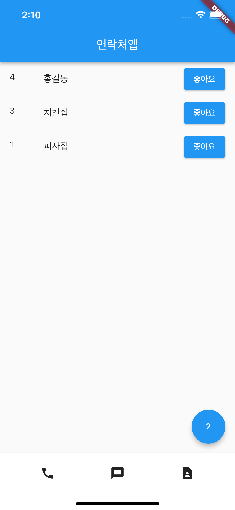

## Check Widget parameters (Android Studio)
* Mac: ⌥ + spacce

## Widgets
### Row() or Column()
mainAxisAlignment 파라미터로 위젯들이 배치되는 간격을 조절할 수 있습니다. 

### SizedBox()
Container()인데 사이즈만 필요할 때 씁니다.

### C1_exercise1
### C1_exercise2
### C1_exercise3
### C1_exercise4

